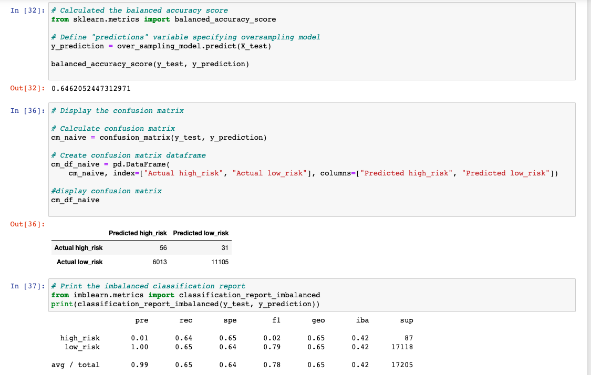
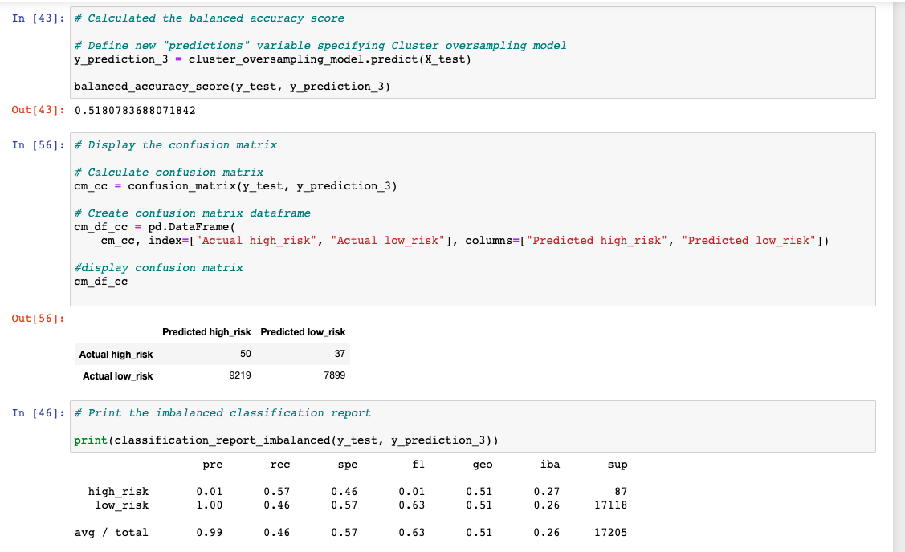
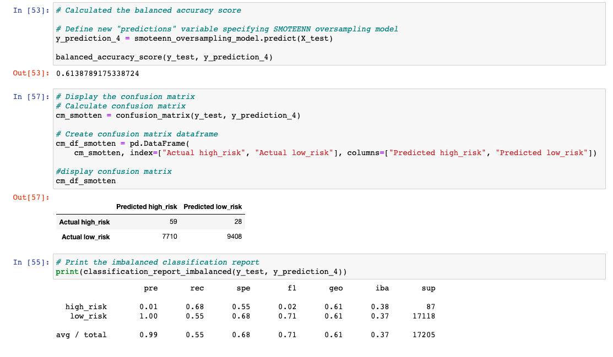

# Credit_Risk_Analysis

##  Overview

The goal of this project is to use the imbalanced-learn and scikit-learn libraries in order to evaluate models using resampling for the credit industry. Credit risk is an inherently unbalanced classification problem, as good loans easily outnumber risky loans. As a result, we need to use different techniques to train and evaluate models with unbalanced classes. The output of the analysis is as follows in order to predict credit risk:

- [credit_risk_resampling](credit_risk_resampling.ipynb) 
  - Oversampling
    - Naive Random 
    - SMOTE 
  - Undersampling
    - ClusterCentroids
  - Combination (Over and Under) Sampling
    - SMOTEENN
- [credit_risk_ensemble](credit_risk_ensemble.ipynb)
  - Uses Ensemble Classifiers
    - Balanced Random Forest Classifier
    - Easy Ensemble AdaBoost Classifier

## Results 
### Credit Risk Resampling:
#### Oversampling 
- Naive Random Oversampling
  - Balanced Accuracy Score: 64% 
  - 

- SMOTE Oversampling
  - Balanced Accuracy Score: 65% 
  - 

#### Undersampling 
- Cluster Centroids Resampler
  - Balanced Accuracy Score: 52% 
  - 

#### Combination (Over and Under) Sampling
- SMOTE Oversampling
  - Balanced Accuracy Score: 61% 
  - 

----------------------------------
### Credit Risk Ensemble:
- Balanced Random Forest Classifier
  - Balanced Accuracy Score: 79% 
  - 

- Easy Ensemble AdaBoost Classifier
  - Balanced Accuracy Score: 93% 
  - 

## Summary
It appears that Easy Ensemble AdaBoost Classifier with a 93% balanced accuracy fits the best for credit risk analysis compared to the other models. The precision in the other model ranged from 50% to 80% which in comparsion to Ensemble AdaBoost Classifier is not even close. 